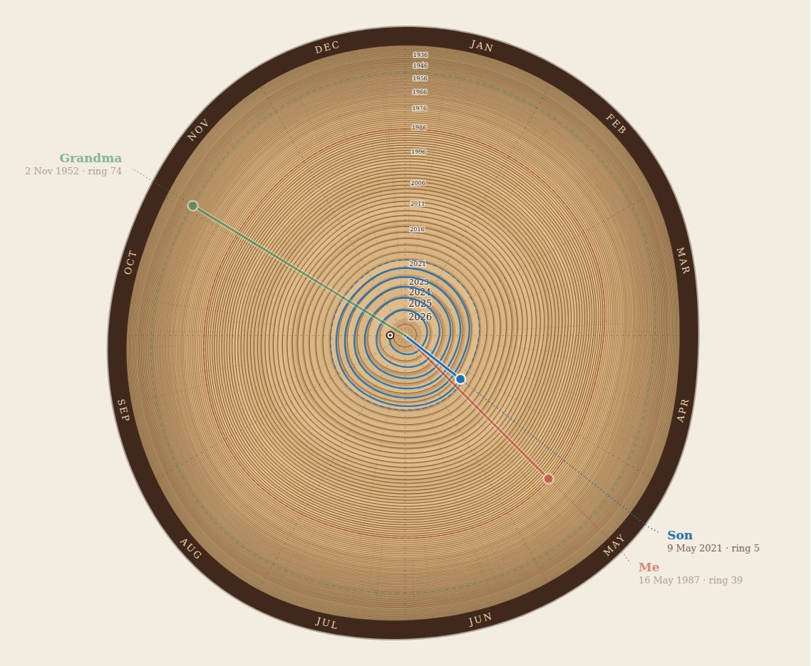

# Year Ring

Draw your family's birthdays as growth rings in a cross-section of a tree.

**Try it: [rkrogh.github.io/year-ring](https://rkrogh.github.io/year-ring/)**



## The idea

The year is a clock face. January runs from 12 to 1 o'clock, February from 1 to 2, and so on. Each year is one ring. The current year sits at the centre, and every older year pushes the rings before it outward, so someone born 16 May 1987 gets a line from the centre to a point between 4 and 5 o'clock, 39 rings out.

A few details that follow from that:

- **Time is one continuous spiral.** Inside a ring, the date also sets the distance from the centre: January 1 is the ring's outer boundary, December 31 its inner one. Selecting a person draws their life as that spiral, from birth to today.
- **Ring spacing is configurable.** Logarithmic (the default) gives recent years more room, so a five-year-old's rings are still readable next to a great-grandparent's. Linear spaces every year equally. Equal area makes outer rings thinner, the way a real tree grows.
- **The centre year is configurable.** Set it to an earlier year to see the family as it was then; anyone born later is listed but not drawn.

## Running it

No build step and no dependencies. Use the hosted page above, or open `index.html` in a browser.

From WSL, either:

```bash
explorer.exe index.html          # opens in the Windows default browser
npm start                        # or serve it on http://localhost:8080
```

## Using it

- Add people with a name, birth date and colour. Each row shows the ring number and age, and warns when a date falls outside the drawn range.
- Click a line in the diagram, or a person card, to highlight them and trace their life spiral.
- "Grow a new grain" reshuffles the wood texture and the outline's wobble.
- Everything is saved in the browser's local storage.
- **PNG** and **SVG** download the image (PNG at twice the SVG's size). **Save JSON** and **Load JSON** move your family between browsers or machines.
- **Copy link** puts the whole state in the URL fragment. The fragment never reaches a server, but anyone you give the link to sees the names and dates.

## Code

| File | Role |
| --- | --- |
| `src/geometry.js` | Pure maths: date to angle, depth (rings), and radius under each scale |
| `src/render.js` | Builds the SVG string from a state object; no DOM access, so the same output serves screen and export |
| `src/app.js` | Editor panel, persistence, selection, export and share |
| `test/` | `node --test` suites for geometry and rendering |

```bash
npm test
```

The scripts are plain browser globals with a CommonJS fallback, so the page works from `file://` (where ES modules are blocked) and the same files load in Node for tests.
